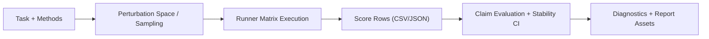

# Architecture Overview

ClaimStab is organized around clear boundaries:

1. `tasks/`
Defines problem instances and metric extraction logic.

2. `methods/`
Declares candidate methods under comparison.

3. `perturbations/`
Defines controllable perturbation dimensions and sampling policy.

4. `runners/`
Executes methods under perturbation configs and returns score rows.

5. `claims/`
Evaluates claim truth/flip behavior and computes stability decisions.

6. `inference/`
Provides inference policies used by claim evaluation (for example Wilson/Beta CI paths).

7. `analysis/`
Aggregates RQ summaries and post-hoc diagnostics across experiments.

8. `evidence/`
Implements CEP (Claim Evidence Protocol) schema/build/validation logic.

9. `core/`
Trace/event primitives and artifact metadata types used across pipelines.

10. `devices/`
Resolves optional device profiles for transpile-only and noisy simulation modes.

11. `atlas/`
Dataset publishing/validation/comparison for ClaimAtlas submissions.

12. `pipelines/`
Shared execution helpers used by CLI examples (suite/space parsing, baseline/key helpers, trace replay loaders).

13. `results/`
Report composition modules (`report_builder`, renderers, plot helpers, section registry).

14. `commands/` + `cli.py`
Command handlers live in `commands/*`; `cli.py` remains parser/bootstrap wiring.

15. `scripts/`
Thin command entrypoints that delegate to reusable modules.

## Data Flow

