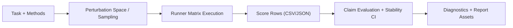

# Architecture Overview

ClaimStab is organized around clear boundaries:

1. `tasks/`
Defines problem instances and metric extraction logic.

2. `methods/`
Declares candidate methods under comparison.

3. `perturbations/`
Defines controllable perturbation dimensions and sampling policy.

4. `runners/`
Executes methods under perturbation configs and returns score rows.

5. `claims/`
Evaluates claim truth/flip behavior and computes stability decisions.

6. `devices/`
Resolves optional device profiles for transpile-only and noisy simulation modes.

7. `scripts/`
Transforms JSON outputs into report artifacts and plots.

## Data Flow

