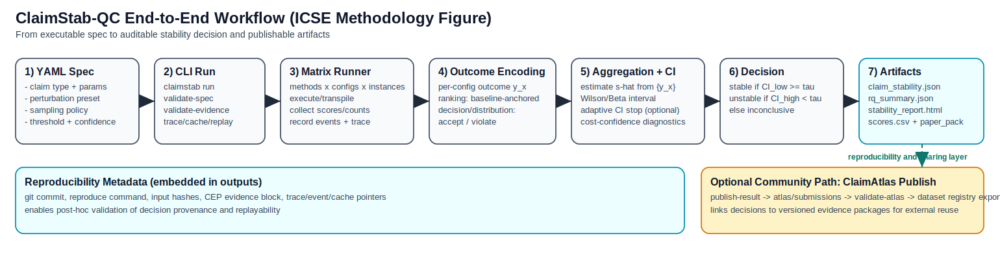

# ClaimStab-QC

ClaimStab-QC is a claim-validation suite for quantum software experiments: it checks whether paper-level conclusions remain true under software-visible perturbations, and reports statistically conservative stability decisions.

## Abstract
Experimental claims in quantum software are often reported as point outcomes from one configuration. ClaimStab-QC reframes evaluation at the claim level: for each claim, we estimate stability under sampled perturbations, compute confidence intervals, and make conservative decisions (`stable`, `unstable`, `inconclusive`). This enables reproducibility-focused reporting beyond single-run metrics.

## Key Idea
Evaluate claims, not just scores.

Given a stability threshold \(p\), a claim is considered stable only when:

\[
\text{CI}_{\text{low}}(\hat{s}) \ge p
\]

where \(\hat{s}\) is the estimated stability rate under sampled perturbation configurations.

## How It Works
1. Define claim semantics (`A >= B + δ`, threshold, decision, distribution).
2. Define perturbation space and sampling policy.
3. Run methods across sampled configurations.
4. Compute claim flips/holds and Wilson confidence intervals.
5. Emit conservative decisions plus diagnostics and report artifacts.

## Results Snapshot
!!! info "Key Results"
    - `compilation_only` is the strongest regime for stability.
    - `sampling_only` is the weakest regime and major instability driver.
    - `combined_light` remains unstable for close method comparisons (e.g., `QAOA_p2` vs `QAOA_p1`).

| Scenario | Observation |
|---|---|
| Best observed | `compilation_only`, `QAOA_p1 > RandomBaseline`, `delta=0.0`, stability ≈ `0.9958` |
| Worst observed | `sampling_only`, `QAOA_p2 > QAOA_p1`, `delta=0.05`, flip-rate ≈ `0.2831` |



## Public Dataset Access

ClaimAtlas submissions are publicly visible and queryable:
- Website page: [Dataset Registry](dataset_registry.md)
- GitHub JSON index: [atlas/index.json](https://github.com/Bossy-Ye/ClaimStab-QC/blob/main/atlas/index.json)
- GitHub packages: [atlas/submissions](https://github.com/Bossy-Ye/ClaimStab-QC/tree/main/atlas/submissions)

## Device-aware Snapshot

| Track | Snapshot |
|---|---|
| `transpile_only` | multi-device structural claims run across IBM fake backend profiles |
| `noisy_sim` | optional extension; environment dependent, does not block main-result reproducibility |

Supporting note: current multi-device transpile-only outputs are often stable on structural metrics; main instability evidence comes from outcome metrics in `sampling_only` / `combined_light`.

## Reproduce (Copy-Paste)

Main paper tracks:

```bash
PYTHONPATH=. ./venv/bin/python examples/exp_comprehensive_calibration.py
PYTHONPATH=. ./venv/bin/python examples/exp_comprehensive_large.py
```

Device-aware extension:

```bash
PYTHONPATH=. ./venv/bin/python examples/multidevice_demo.py --run all --suite standard --out-dir output/multidevice_full
```

## Project Links
- [GitHub Repository](https://github.com/Bossy-Ye/ClaimStab-QC)
- [Quickstart](quickstart.md)
- [Custom Task Quickstart](custom_task_quickstart.md)
- [Dataset Registry](dataset_registry.md)
- [Interactive Playground](playground.md)
- [Examples & Outputs](examples.md)
- [ClaimAtlas Dataset](atlas.md)
- [Extending ClaimStab](concepts/extending.md)
- [Reproduction Contract](reproduction_contract.md)
- [Reproduce](reproduce.md)
- [Results](results/main_results.md)
- [Cite](cite.md)
