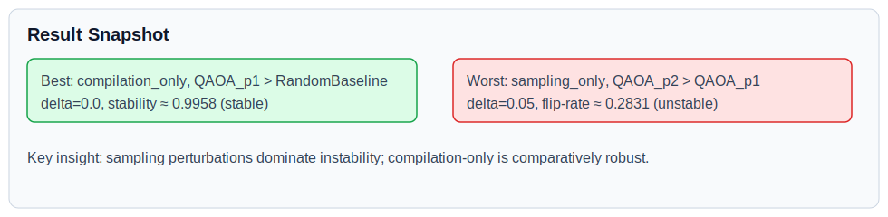

# Main Results

## Experiment Design
Two-phase protocol:
1. **Calibration (exhaustive)**: `standard` suite with full-factorial sampling.
2. **Scale (broad)**: `large` suite with `random_k` sampling.

Both phases evaluate:
- spaces: `compilation_only`, `sampling_only`, `combined_light`
- claim pairs: `QAOA_p2>RandomBaseline`, `QAOA_p2>QAOA_p1`, `QAOA_p1>RandomBaseline`
- deltas: `0.0, 0.01, 0.05`

This produces a 27-row space×claim×delta comparative matrix per phase.

Additional tracks used for generality:
- **Bernstein-Vazirani decision-claim benchmark** (non-optimization control task).
- **GHZ structural compilation benchmark** (circuit-depth / 2Q structural claims).

## Key Takeaways
- `compilation_only` is the most stable regime overall.
- `sampling_only` is the dominant instability source.
- `combined_light` still exposes fragility for close method pairings.
- Conditional robustness maps (RQ5) isolate stable cores and unstable frontiers instead of only reporting a single global verdict.
- Stratified stability and effect diagnostics (RQ6/RQ7) identify which instance strata and knob interactions are most failure-prone.
- All reported decisions are trace-linked through CEP evidence blocks and can be checked with `claimstab validate-evidence`.

## Snapshot Rows

| Case | Space | Claim | Delta | Metric |
|---|---|---|---:|---|
| Best observed | `compilation_only` | `QAOA_p1 > RandomBaseline` | 0.0 | stability ≈ `0.9958` (stable) |
| Worst observed | `sampling_only` | `QAOA_p2 > QAOA_p1` | 0.05 | flip-rate ≈ `0.2831` (unstable) |

## Artifacts
- Comparative JSON/CSV matrix is available in experiment outputs.
- Report HTML contains per-experiment CI and decision summaries.
- Naive baseline reporting is dual-policy:
  - `naive_baseline` (`legacy_strict_all`) keeps historical comparability.
  - `naive_baseline_realistic` (`default_researcher_v1`) reflects default-practice interpretation.
  - Policy-by-delta counts are exported in `output/paper_pack/tables/naive_policy_delta_snapshot.csv`.
